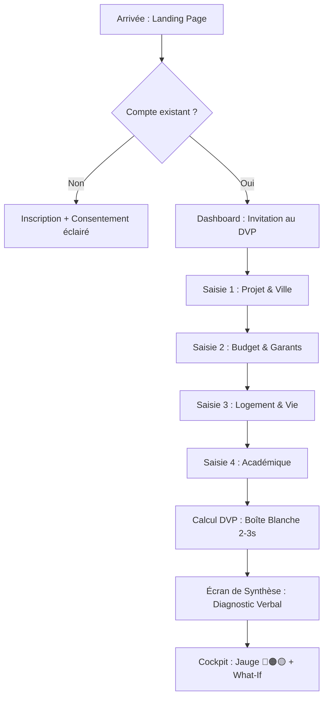

# UX Design Specification TrailLearn

**Author:** aubinaso
**Date:** Thursday, January 15, 2026

---

<!-- UX design content will be appended sequentially through collaborative workflow steps -->

## Executive Summary

### Project Vision
TrailLearn est un "tiers de confiance préventif" conçu pour sécuriser les projets de mobilité internationale des étudiants. Contrairement aux plateformes classiques axées sur la sélection, TrailLearn privilégie la **responsabilité structurelle** et la **lucidité décisionnelle**. Le cœur du produit est le **Dossier de Viabilité du Parcours (DVP)**, un stress-test algorithmique transparent qui confronte les intentions de l'étudiant à la réalité du terrain (budget, logement, académique). L'objectif est de transformer l'incertitude anxieuse en un plan d'action sécurisé et viable.

### Target Users
*   **Sarah (L'Étudiante en mobilité)** : Jeune, ambitieuse mais anxieuse face aux risques financiers et administratifs. Elle cherche de la clarté et une validation objective de son projet. Elle a besoin d'être rassurée par des faits, pas par des promesses marketing.
*   **Thomas (L'Administrateur / Garant)** : Expert métier responsable de la fiabilité des données. Il a besoin d'outils précis pour maintenir le "Standard de Vérité" (coût de la vie, règles académiques) à jour.
*   **Les Mentors (Utilisateurs secondaires/futurs)** : Accompagnateurs qui interviennent pour aider à résoudre les fragilités identifiées par le système.

### Key Design Challenges
*   **Réduire l'anxiété par la clarté** : Présenter des résultats potentiellement négatifs (🔴 Non Viable) de manière constructive et non punitive.
*   **Expliquer l'algorithme ("Boîte Blanche")** : Rendre compréhensible le calcul de viabilité sans noyer l'utilisateur sous des détails techniques. Chaque résultat doit être justifié par une règle claire.
*   **Gérer la complexité de la saisie** : Le DVP demande beaucoup d'informations (budget détaillé, notes, etc.). L'interface doit rendre cette saisie fluide, progressive et gratifiante.

## Core User Experience

### Defining Experience
L'expérience centrale de TrailLearn ne réside pas dans la saisie de données, mais dans **l'acquisition de lucidité**. L'action critique est la **compréhension du diagnostic de viabilité** (et non la simple complétion du formulaire). L'utilisateur ne doit pas avoir l'impression de remplir un dossier administratif, mais de "mettre de la lumière" sur son projet de vie. La valeur est délivrée lorsque l'étudiant peut dire : "Je sais si mon projet tient debout et pourquoi".

### Platform Strategy
*   **Stratégie Web App (V1)** :
    *   **Desktop-First** : Priorité absolue pour les phases de réflexion profonde, de saisie du DVP et de simulation "What-If". L'interface doit exploiter l'espace pour clarifier la complexité.
    *   **Mobile-Friendly** : Usage secondaire axé sur la consultation rapide, la réassurance et le partage (PDF).
*   **Offline** : Pas de mode hors-ligne complet pour l'application, mais le **PDF exporté** agit comme un artefact "offline" crucial (preuve tangible, partageable avec les parents/garants).

### Effortless Interactions
La magie ne vient pas de l'automatisation opaque, mais de la **réduction de la charge mentale**.
*   **Saisie Assistée & Pédagogique** : Le système pré-remplit des estimations réalistes (coût de la vie basé sur la ville choisie) et fournit des ordres de grandeur ("budget typique : 800€").
*   **Dédramatisation** : Des messages rassurants ("Vous pourrez affiner plus tard", "Ce n'est qu'une estimation") encouragent la progression sans blocage.
*   **Transparence ("Boîte Blanche")** : L'utilisateur garde le contrôle sur les valeurs par défaut. Rien n'est "magique" sans explication.

### Critical Success Moments
Le moment de vérité est une séquence émotionnelle en deux temps :
1.  **Le Diagnostic Verbal (Synthèse)** : Une phrase humaine et empathique qui explique le résultat avant tout visuel ("Ton projet est fragile financièrement, mais viable si..."). C'est ici que l'anxiété chute.
2.  **La Confirmation Visuelle (Jauge)** : La visualisation (🔴🟠🟡) ancre le diagnostic et objective la réalité. Elle ne surprend pas, elle confirme.

## Desired Emotional Response

### Primary Emotional Goals
L'émotion primaire visée par TrailLearn est le **Soulagement Lucide**. Ce n'est ni l'excitation de la promesse, ni la peur du risque, mais **l'apaisement par la compétence**. L'utilisateur doit ressentir qu'il reprend le contrôle sur une situation complexe et anxiogène. La promesse émotionnelle est : "Je ne suis plus dans le flou, je sais où je vais".

### Emotional Journey Mapping
1.  **Avant (Arrivée)** : *Anxiété diffuse & Surcharge mentale*. "Est-ce que je vais y arriver ? Ai-je pensé à tout ?"
2.  **Pendant (Saisie DVP)** : *Prise en main & Clarté progressive*. "Ah, c'est logique. Je comprends pourquoi on me demande ça." L'utilisateur se sent guidé par une structure solide.
3.  **Moment de Vérité (Résultat)** : *Choc de réalité constructif -> Acceptation*. "Ok, voici la réalité de mon projet." Pas de faux espoirs, pas de jugement brutal.
4.  **Après (What-If)** : *Puissance & Capacité d'agir*. "Je peux bouger les curseurs. Je ne subis pas, je décide."

### Micro-Emotions
*   **Contre la Honte** : Un résultat 🔴 ne juge pas la personne ("Tu es pauvre"), mais la configuration du projet ("Ce budget est trop juste pour Paris").
*   **Confiance (Trust)** : L'algorithme est un allié transparent, pas un juge opaque.
*   **Détermination Calme** : Transformer la déception potentielle en plan d'action immédiat grâce aux leviers d'ajustement.

### Design Implications
*   **Tone of Voice : Expert Bienveillant**. Le système parle avec calme, précision et factualité. Il n'utilise pas d'exclamations marketing ("Génial !", "Oups !") mais des constats clairs et aidants.
*   **Feedback Constructif** : Jamais de 🔴 orphelin. Chaque alerte doit être accompagnée (1) de la cause précise et (2) d'un lien direct vers l'ajustement possible.
*   **Rythme Apaisant** : La saisie ne doit pas être une course. L'interface doit respirer pour laisser le temps à la réflexion.

## UX Pattern Analysis & Inspiration

### Inspiring Products Analysis
1.  **YNAB (You Need A Budget)** : La référence absolue pour la gestion de l'anxiété financière. YNAB transforme le budget en un système de contrôle actif et bienveillant.
    *   *Core Delight* : La philosophie "Give every dollar a job" et la gestion déculpabilisée des imprévus ("Roll with the punches").
2.  **TurboTax / TaxFix** : La transformation de la complexité administrative en conversation fluide.
    *   *Core Delight* : Le découpage "Une question à la fois" et l'explication contextuelle ("Pourquoi on demande ça ?").
3.  **Configurateurs Auto (ex: Tesla)** : L'expérience ultime de la simulation instantanée.
    *   *Core Delight* : Le feedback immédiat. Je change un paramètre, le résultat (prix/autonomie) s'ajuste en temps réel. C'est le sentiment de puissance pure.

### Transferable UX Patterns
*   **"Give Every Euro a Job" (YNAB)** : Appliquer ce principe au DVP. L'argent n'est pas une masse floue, mais des allocations précises (Loyer, Transport, Nourriture).
*   **Conversational Wizard (TurboTax)** : Remplacer le formulaire monolithique par une séquence aérée, étape par étape, avec une aide contextuelle toujours visible.
*   **Instant Feedback Loop (Tesla)** : Pour le simulateur "What-If", la mise à jour de la jauge de viabilité doit être instantanée (<200ms) pour créer un sentiment de maîtrise.

### Anti-Patterns to Avoid
*   **L'Effet "Cerfa Numérique" (Parcoursup)** : Formulaires denses, jargon administratif, absence d'explications, stress des délais opaques. À bannir absolument.
*   **La Gamification Infatilisante (Duolingo)** : TrailLearn est un outil de vie sérieux. Pas de mascottes qui pleurent, pas de "streaks" artificiels pour culpabiliser. L'engagement doit venir de la valeur, pas des tricks.
*   **La Boîte Noire Magique** : "Fais-nous confiance, on gère". Non. TrailLearn doit toujours montrer ses calculs.

## Design System Foundation

### 1.1 Design System Choice
**Shadcn/ui** (basé sur **Tailwind CSS** et Radix UI).
Ce choix stratégique privilégie la modularité, la performance et la flexibilité visuelle, tout en offrant une base de composants robustes et accessibles.

### Rationale for Selection
1.  **Balance Sérieux/Chaleur** : Shadcn/ui offre par défaut un esthétisme minimaliste et moderne ("Clean") qui évite à la fois la froideur "Enterprise" (Ant Design) et la généricité "Corporate" (Material UI). C'est idéal pour incarner l'Expert Bienveillant.
2.  **Modularité & Performance** : Contrairement aux librairies monolithiques, nous ne chargeons que ce que nous utilisons. C'est crucial pour une Web App performante.
3.  **Vitesse de Développement** : L'approche "Copy-Paste" permet d'itérer très vite sur le tunnel DVP sans être bloqué par des overrides complexes.
4.  **Next.js Native** : Intégration parfaite avec notre stack technique probable (Next.js/React).

### Implementation Approach
*   **Core Experience (Sarah)** : Utilisation de composants avec un espacement généreux, des ombres douces et une typographie très lisible pour réduire la charge cognitive du DVP.
*   **Admin Interface (Thomas)** : Utilisation de versions plus denses des composants (Data Tables, Filters) pour la gestion efficace des règles métier, tout en restant cohérent visuellement.

## 2. Core User Experience

### 2.1 Defining Experience
L'expérience définissante de TrailLearn est le **Dossier de Viabilité du Parcours (DVP)**, vécu non comme un formulaire, mais comme une séquence de **clarification active**.
Le cycle est : **Saisie conversationnelle -> Diagnostic de Vérité -> Simulation (What-If)**.
C'est le moment où l'utilisateur passe de "Je rêve d'aller en France" (intention floue) à "Je sais que mon projet tient la route à Lyon avec 800€/mois" (lucidité actionnable).

### 2.2 User Mental Model
*   **Actuel (Silos Flous)** : L'étudiant gère son projet en pièces détachées : un visa d'un côté, un budget approximatif de l'autre, une ville rêvée. Il ne voit pas les liens de cause à effet.
*   **Cible (Système Interconnecté)** : TrailLearn connecte les silos. "Si je change de ville (Lyon vs Paris), mon besoin budgétaire baisse, donc mon épargne actuelle devient suffisante pour le visa".
*   **Transformation** : Passer d'une "Checklist mentale anxiogène" à un "Tableau de bord de pilotage".

### 2.3 Success Criteria
1.  **Sentiment de Valeur Immédiate** : Pendant la saisie, le système donne de l'info ("À Paris, un studio coûte environ 800€") avant même d'avoir fini le dossier.
2.  **Compréhension Causale** : L'utilisateur sait exactement pourquoi son dossier est Orange ou Rouge (ex: "Épargne insuffisante pour le critère Visa").
3.  **Empowerment par le Jeu** : L'utilisation du "What-If" doit provoquer un sentiment de soulagement ("Ah, je peux y arriver si je change juste ce paramètre").

### 2.4 Novel UX Patterns
*   **Saisie (Habitude)** : Pattern "Conversational Wizard" (Typeform/TurboTax). On reste sur du connu pour rassurer et fluidifier.
*   **What-If (Nouveauté)** : Pattern "Live Configurator" (Tesla). C'est l'innovation majeure : rendre dynamique un processus habituellement statique et administratif.

## Visual Design Foundation

### Color System
*   **Primary : Blue-600 (#2563EB)**. Incarne la confiance, l'institutionnel et l'expertise. Utilisé pour les actions principales (CTA), la navigation active et les focus.
*   **Secondary / Success : Emerald-500 (#10B981)**. Incarne la croissance, la validation et la bienveillance. Utilisé pour les jauges positives, les indicateurs de succès et la progression.
*   **Warning / Attention : Amber-500 (#F59E0B)**. Utilisé pour les états "Viable sous conditions", les alertes non bloquantes et les appels à l'action secondaires (Upgrade).
*   **Destructive : Red-500 (#EF4444)**. Réservé aux erreurs bloquantes et actions irréversibles. Usage parcimonieux pour ne pas générer d'anxiété.
*   **Neutral / Backgrounds** : Slate-50 à Slate-900. Fonds clairs et lumineux (White/Slate-50) pour maximiser la lisibilité et la "respiration" de l'interface.

### Typography System
*   **Main Font : Inter**. Sans-serif moderne, neutre et extrêmement lisible.
    *   Regular (400) : Corps de texte.
    *   Medium (500) : Labels, sous-titres.
    *   Semibold (600) : Titres, CTA.
*   **Data Font : JetBrains Mono**. Monospace pour les données financières, les résultats chiffrés du DVP et les identifiants. Renforce l'aspect "outil de précision" et facilite la lecture tabulaire des chiffres.

### Spacing & Layout Foundation
*   **Base Unit : 8px**.
*   **Radius : 0.5rem (8px)**. Douceur modérée, ni trop carré (brutal), ni trop rond (infantil).
*   **Density Strategy** : "Airy Desktop". Priorité à l'espace blanc pour favoriser la réflexion. Largeur de lecture contrainte (~600px) pour les formulaires step-by-step afin de focaliser l'attention.

## Design Direction Decision

### Design Directions Explored
1.  **The Focus Tunnel** : Minimalisme radical, une question à la fois, zéro distraction. Idéal pour la phase de saisie initiale.
2.  **The Cockpit Dashboard** : Contrôle global avec sidebar de navigation, zone de diagnostic centrale et simulateur "What-If" latéral. Idéal pour l'analyse et l'empowerment.
3.  **The Story Scroller** : Approche narrative type document de vie, flux continu.

### Chosen Direction
**Direction 2 : "The Cockpit Dashboard" (Hybride)**.
Le layout "Cockpit" est retenu pour l'écran principal de pilotage du DVP. La "Direction 1" (Focus Tunnel) sera réutilisée spécifiquement pour les phases de saisie pas-à-pas (Wizard) afin de réduire la charge cognitive.

### Design Rationale
*   **Connexion des Silos** : Le layout Cockpit permet de voir simultanément les piliers du projet, le diagnostic global et les leviers d'ajustement.
*   **Empowerment Immédiat** : Le simulateur "What-If" à droite permet une boucle de feedback instantanée entre l'action de l'utilisateur et le résultat (🔴🟠🟡).
*   **Crédibilité "Boîte Blanche"** : La zone centrale offre l'espace nécessaire pour justifier le diagnostic par des chiffres clairs (JetBrains Mono) et des explications textuelles.

## User Journey Flows

### Parcours 1 : Sarah - Du flou à la lucidité (Tunnel DVP)
Ce parcours est le cœur de l'expérience de découverte. Il transforme une intention vague en un plan d'action lucide.



### Parcours 2 : Sarah - L'ajustement dynamique (What-If)
Ce parcours d'empowerment permet à l'utilisateur de reprendre le contrôle sur un diagnostic fragile.

```mermaid
graph TD
    A[Cockpit : Jauge 🟠 ou 🔴] --> B[Identification du levier : "Trop cher pour Paris"]
    B --> C[Ouverture du volet What-If]
    C --> D[Action : Changement de ville (ex: Lyon)]
    D --> E[Calcul instantané <200ms]
    E --> F[Résultat : Jauge 🟢]
    F --> G[Soulagement : "C'est possible à Lyon"]
    G --> H[Action : Sauvegarder ce scénario]
    H --> I[Dashboard : Projet actualisé]
```

### Parcours 3 : Thomas - Garantie du Standard de Vérité (Admin)
Ce parcours assure la fiabilité et la crédibilité de l'ensemble du système.

```mermaid
graph TD
    A[Alerte : Hausse des loyers] --> B[Connexion Back-office]
    B --> C[Navigation : Référentiels > Villes]
    C --> D[Action : Edition du seuil de loyer]
    D --> E[Revue d'impact : "X dossiers affectés"]
    E --> F[Validation + Note d'audit]
    F --> G[Déploiement global]
```

### Journey Patterns
*   **Progressive Disclosure** : On ne demande jamais tout en même temps. Les informations sont sollicitées uniquement quand elles sont nécessaires au calcul.
*   **Boîte Blanche (Explainability)** : Chaque transition de résultat est accompagnée d'une explication textuelle des causes.
*   **Boucle de Feedback Instantanée** : Dans le What-If, l'action de l'utilisateur (Input) et la réaction du système (Output) sont visuellement liées et immédiates.

## Component Strategy

### Design System Components
TrailLearn s'appuie sur **shadcn/ui** pour ses composants de base, garantissant accessibilité et robustesse technique.
*   **Composants natifs utilisés** : Button, Progress, Card, Select, Radio Group, Dialog, Tooltip, Avatar, Tabs.
*   **Adaptation** : Application systématique des tokens de marque (Blue-600, Emerald-500, Amber-500) et des arrondis (8px).

### Custom Components
Quatre composants spécifiques sont conçus pour porter l'expérience unique de TrailLearn :

1.  **ViabilityGauge (La Jauge de Vérité)** :
    *   *But* : Visualiser le diagnostic de viabilité de manière objective.
    *   *Anatomie* : Barre segmentée ou arc sobre avec zones de couleurs (🔴🟠🟢). Étiquette centrale verbale explicite ("Viable sous conditions").
    *   *États* : Inconnu (Gris) -> Calcul en cours (Animation sobre) -> Résultat affiché.

2.  **InsightCard (La Boîte Blanche)** :
    *   *But* : Expliquer le "Pourquoi" derrière chaque diagnostic.
    *   *Contenu* : Lien direct entre un fait ("Loyer Paris : 800€") et une règle ("Seuil Visa France").
    *   *Action* : Toujours accompagnée d'un lien vers une action corrective ou le simulateur What-If.
    *   *Variantes* : Info, Succès, Warning, Fragilité.

3.  **WhatIfSlider (Le Levier d'Empowerment)** :
    *   *But* : Permettre la simulation dynamique sans altérer les données réelles du DVP.
    *   *Feedback* : Affichage d'un "Delta" d'impact avant application des changements.
    *   *Principe* : Réversible et explicable.

4.  **PedaLink (Le Micro-composant Pédagogique)** :
    *   *But* : Réduire la peur du jugement pendant la saisie.
    *   *Usage* : Lien discret "Pourquoi c'est important ?" ou "D'où vient ce chiffre ?" ouvrant un tooltip ou une micro-explication contextuelle.

5.  **ChatInterface (Le Miroir Lucide - Epic 7)** :
    *   *But* : Porter la conversation maïeutique d'orientation.
    *   *Anatomie* : Zone de dialogue fluide, bulles distinctes (IA = Neutre/Expert, User = Accentué). Indicateur de "Pensée" (Streaming) visible pour matérialiser la réflexion.
    *   *Interaction* : Réponses libres ou Chips de suggestion pour fluidifier.
    *   *Mobile* : Plein écran immersif pour favoriser l'introspection. Desktop : Sidebar persistante ou Modal large.

6.  **FocusDashboard (Le Secrétaire Logistique - Epic 8)** :
    *   *But* : Réduire la charge mentale de l'exécution.
    *   *Anatomie* : Affichage strict des **3 prochaines actions**. Le reste du backlog est masqué sous un pli "Voir tout le plan" (discret).
    *   *Feedback* : Micro-célébration (confettis sobres) à la complétion d'une tâche.
    *   *Ton* : Neutre et encourageant ("Voici ta prochaine étape").

### Component Implementation Strategy
*   **Atomic Design** : Les composants custom sont bâtis en utilisant les primitives de shadcn/ui et les utilitaires Tailwind CSS.
*   **Boîte Blanche par défaut** : Chaque composant affichant un résultat calculé doit intégrer ou pointer vers une `InsightCard`.
*   **Accessibilité** : Respect strict du contraste et des labels ARIA, particulièrement pour la `ViabilityGauge` qui ne doit jamais reposer uniquement sur la couleur.

## UX Consistency Patterns

### Button Hierarchy
*   **Action Primaire (Blue-600)** : Une seule action principale par écran (ex: "Suivant", "Calculer ma viabilité"). Guide l'utilisateur vers la réussite.
*   **Action Secondaire (Outline/Ghost)** : Actions de navigation ou de report (ex: "Précédent", "Plus tard"). Évite la surcharge visuelle.
*   **Action d'Empowerment (Amber-500)** : Réservée aux transitions vers le What-If ou les montées en gamme (Upgrade). Marque un moment de reprise de contrôle.
*   **Action Critique (Red-500)** : Usage rare pour les destructions de données. Ne doit jamais être confondu avec un résultat de diagnostic métier.

### Feedback Patterns
*   **Succès (Vert)** : Confirmation d'action (sauvegarde, complétion, DVP Viable).
*   **Alerte (Ambre)** : Le cœur informatif du produit. Utilisé pour les seuils fragiles et le diagnostic "Viable sous conditions".
*   **Erreur (Rouge)** : Uniquement pour les erreurs techniques ou de saisie aberrante. 
*   **Note Cruciale** : Un DVP 🔴 (Non Viable) est une **information métier**, pas une erreur système. Il utilise une sémantique visuelle sérieuse mais non punitive (ex: badge ou texte explicite, jamais de rouge clignotant de type "System Error").

### Form Patterns
*   **One-Thing-at-a-Time** : Saisie découpée en étapes thématiques (Projet, Budget, etc.) pour focaliser l'attention et réduire la fatigue cognitive.
*   **Saisie Pédagogique (PedaLink)** : Chaque champ complexe intègre un lien "Pourquoi ?" ou "Aide au calcul" pour maintenir la transparence ("Boîte Blanche").
*   **Validation Inline Bienveillante** : Les erreurs de saisie sont signalées immédiatement avec un ton aidant ("Ce montant semble inhabituel, peux-tu vérifier ?") plutôt que sec ou technique.

### Navigation Patterns
*   **Cockpit Navigation** : Navigation par piliers persistants (Budget, Logement, etc.) permettant de naviguer sans perdre sa progression.
*   **États de Chargement (Skeletons)** : Utilisés pendant le calcul DVP (2-3s) pour matérialiser le travail du système et rassurer sur la rigueur du traitement.

### Notifications & Transactionnel
*   **Notifications Sobres** : Uniquement transactionnelles (ex: "DVP sauvegardé", "Profil mis à jour").
*   **Pas d'Anxiété** : Pas de notifications push intrusives ou de rappels stressants. TrailLearn respecte le temps de réflexion de l'utilisateur. Les diagnostics ne sont jamais annoncés par notification mais découverts dans l'espace de pilotage.

### Implementation Approach
*   **Framework** : Utilisation des composants **shadcn/ui** personnalisés avec le thème TrailLearn (Bleu-600, Emerald-500, Amber-500).
*   **Prototype HTML** : Une référence interactive a été générée (`ux-design-directions.html`) servant de base pour l'implémentation front-end.
*   **Réactivité** : Sidebar pliable on mobile, priorité au contenu de diagnostic au centre. Saisie en mode "Focus Tunnel" plein écran.

## Responsive Design & Accessibility

### Responsive Strategy
TrailLearn adopte une stratégie d'adaptation par usage, privilégiant la profondeur sur Desktop et la consultation agile sur Mobile.
*   **Desktop (Le Cockpit complet)** : Utilisation du triptyque Navigation | Analyse | What-If pour une expérience de lucidité totale.
*   **Tablette** : Simplification avec sidebar What-If pliable (Drawer) pour préserver la lisibilité de l'analyse centrale.
*   **Mobile (Le Compagnon)** : Passage en mode "Compagnon". La saisie DVP utilise le mode "Focus Tunnel" plein écran. Le Chatbot (Epic 7) passe en plein écran pour l'immersion. Le What-If est accessible via un "Bottom Sheet" (tiroir bas). Navigation simplifiée par une Tab Bar (Dashboard, Mon DVP, Forums, Profil).

### Breakpoint Strategy
Alignement sur les standards de **shadcn/ui** et Tailwind CSS :
*   **Mobile (< 768px)** : Layout 1 colonne, navigation basse.
*   **Tablet (768px - 1024px)** : Layout 2 colonnes, navigation pliable.
*   **Desktop (> 1024px)** : Layout 3 colonnes (Cockpit complet).

### Accessibility Strategy
Engagement sur un niveau de conformité **WCAG 2.1 AA** pour garantir l'inclusion et la fiabilité :
*   **Contraste** : Ratio minimum de 4.5:1 sur tous les éléments porteurs d'information.
*   **Navigation Clavier** : Support complet (Tab, Enter, Escape) avec focus visuel explicite (Ring Blue-600).
*   **Lecteurs d'écran** : Labels ARIA descriptifs pour tous les composants custom, notamment pour traduire verbalement le statut de la `ViabilityGauge` et les réponses du Chatbot.
*   **Cibles tactiles** : Minimum 44x44px sur mobile pour tous les éléments interactifs.
*   **Alternative à la couleur** : Un diagnostic (🔴🟠🟢) n'est jamais communiqué par la couleur seule ; il est toujours doublé d'un texte explicite ou d'une icône.

### Testing Strategy
*   **Responsive** : Tests sur les navigateurs majeurs (Chrome, Safari, Firefox) et une sélection de devices réels (iOS/Android). Priorité Chrome Mobile & Safari iOS.
*   **Accessibilité** : Audits automatisés réguliers (Lighthouse, axe-core) complétés par des tests manuels au clavier et avec lecteurs d'écran (VoiceOver/NVDA).

### Implementation Guidelines
*   **Unités Relatives** : Utilisation systématique des `rem` et `%` pour la flexibilité.
*   **Mobile-First Queries** : Développement des styles en partant du mobile pour remonter vers le desktop.
*   **HTML Sémantique** : Utilisation stricte des balises HTML5 appropriées pour faciliter la navigation assistée.

